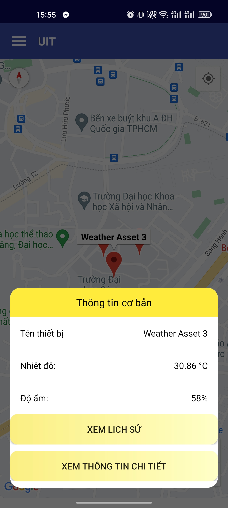
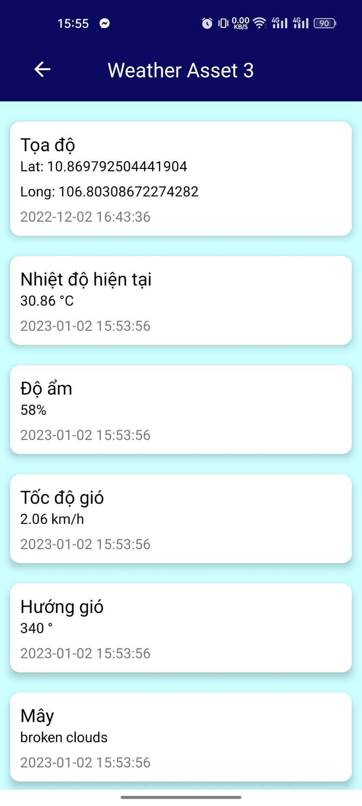
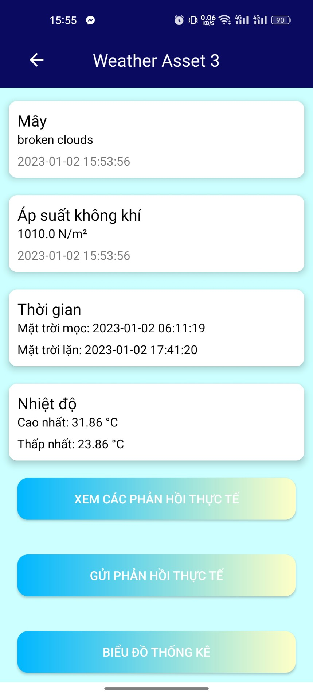
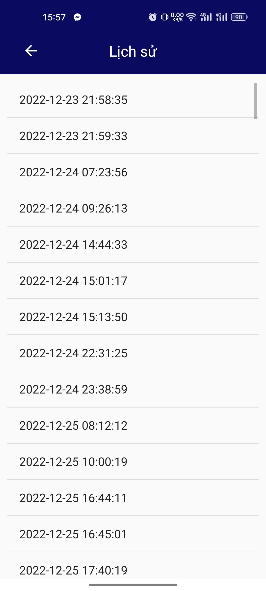
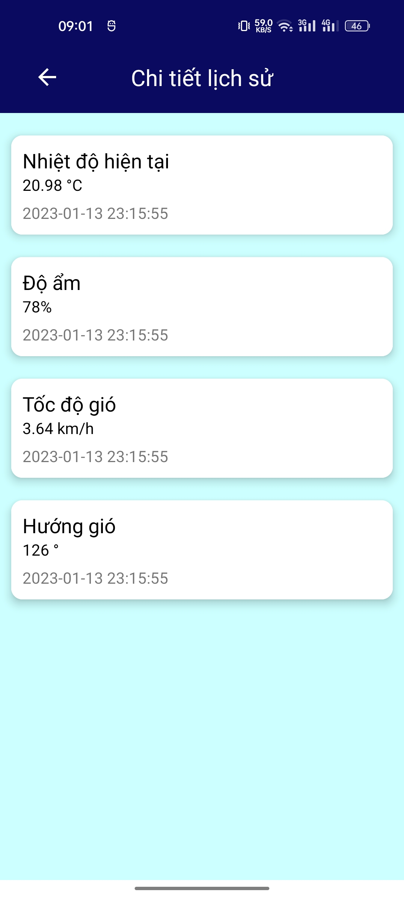
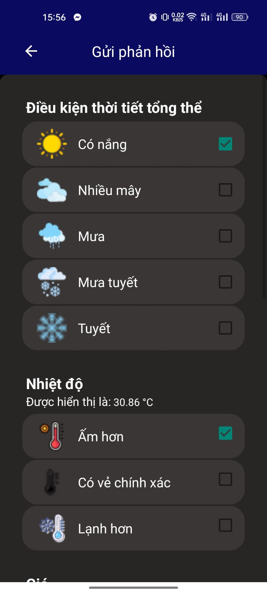
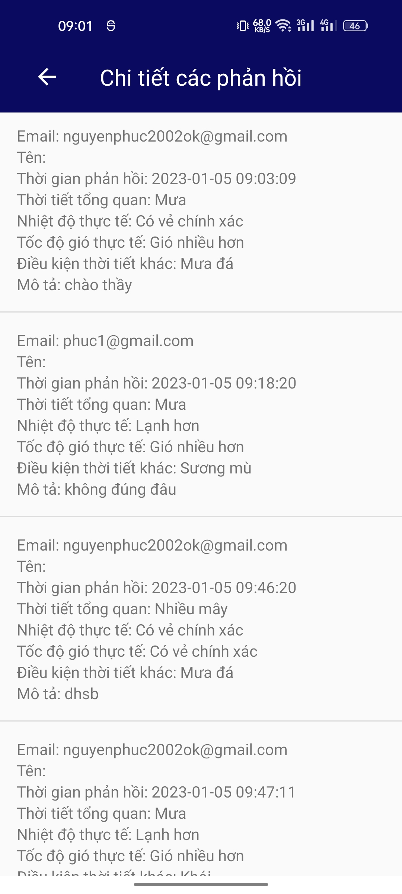

# Introduce

The Internet of Things (IoT) is a network of devices that feeds data into a platform to enable communication and automated control. IoT connects machines to other machines as well as people. This seamless connection between machines, humans, and data means that IoT simplifies, improves, and automates processes. Sensors, coupled with connectivity and artificial intelligence, have the potential to make several systems more efficient. Therefore, an IoT mobile application is necessary to provide information to users timely. 

## Getting Started

These instructions will give you a copy of the project up and running on
your local machine for development and testing purposes. See deployment
for notes on deploying the project on a live system.

### Feature

- Effectively visualize connected data from sensors (temperature, air information, humility) on the Map (using openRemote API,GoogleMap API, MPAndoirdChart, SQLite).
- Sign up, sign in (Authentication Firebase).
- Feedback from user (Realtime database Firebase).

### Installing

A step by step series of examples that tell you how to get a development
environment running

Clone project

    git clone https://github.com/phucnt2002/android.git

Loggin https://103.126.161.199/swagger/

Get token and replace into APIClient file

## Demo
#### Sign up, loggin

  
  

#### Summary weather

  

#### Detail weather

  
  

#### History weather

  
  

#### Feedback weather

  
  

